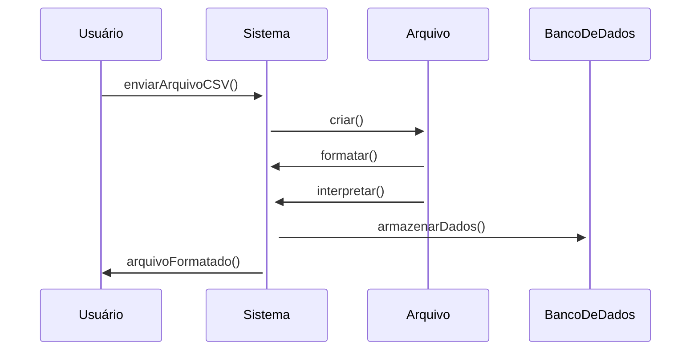
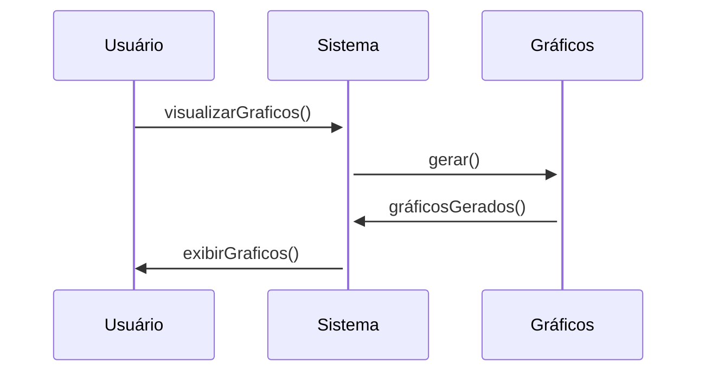
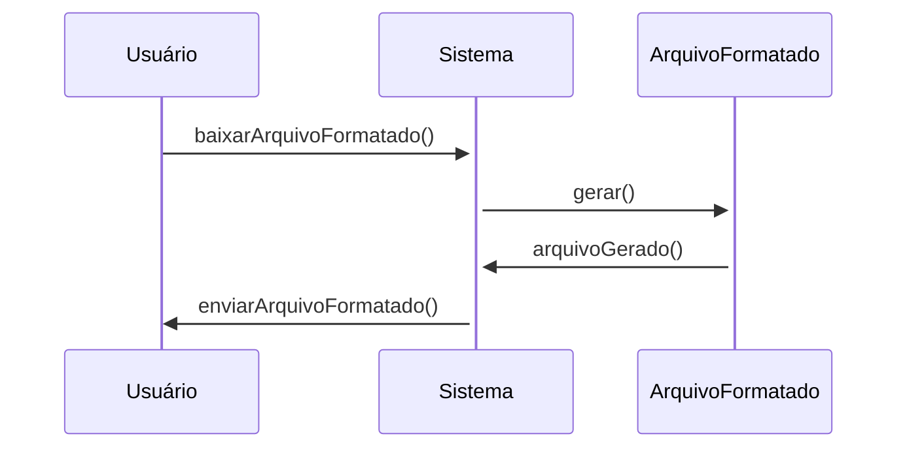
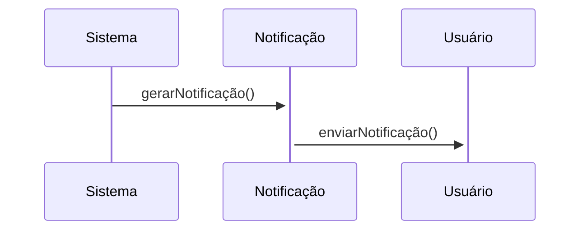
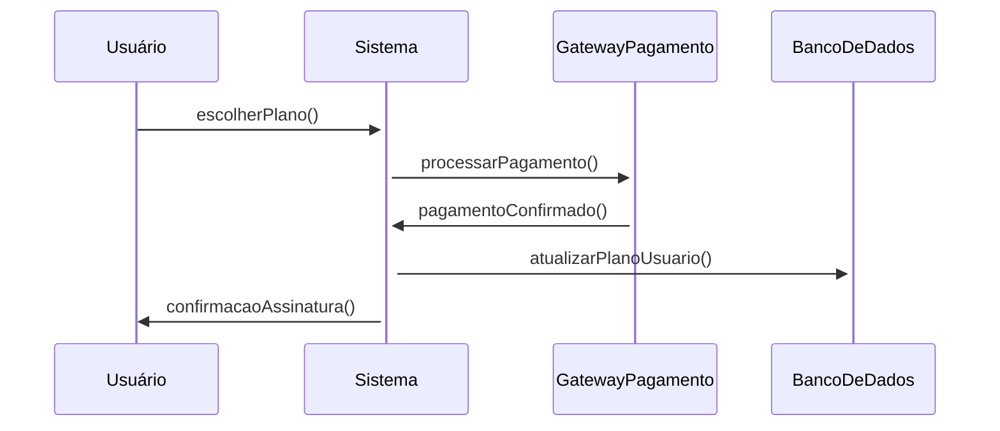
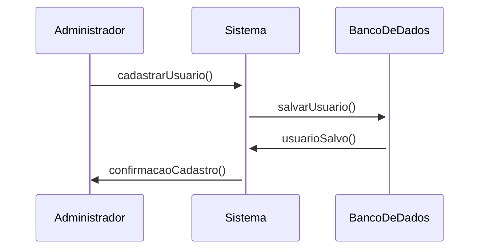
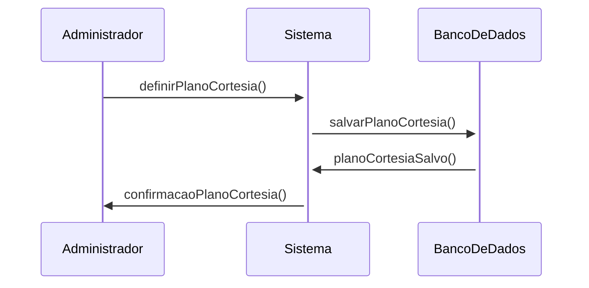
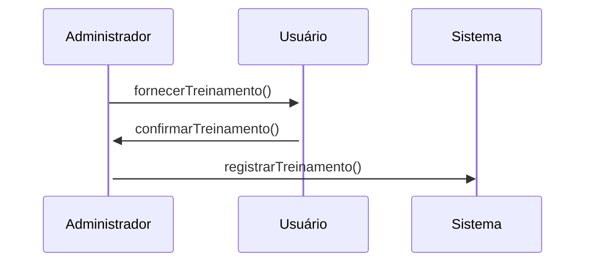
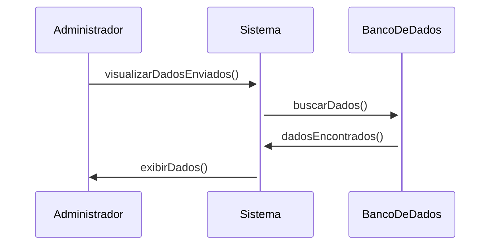
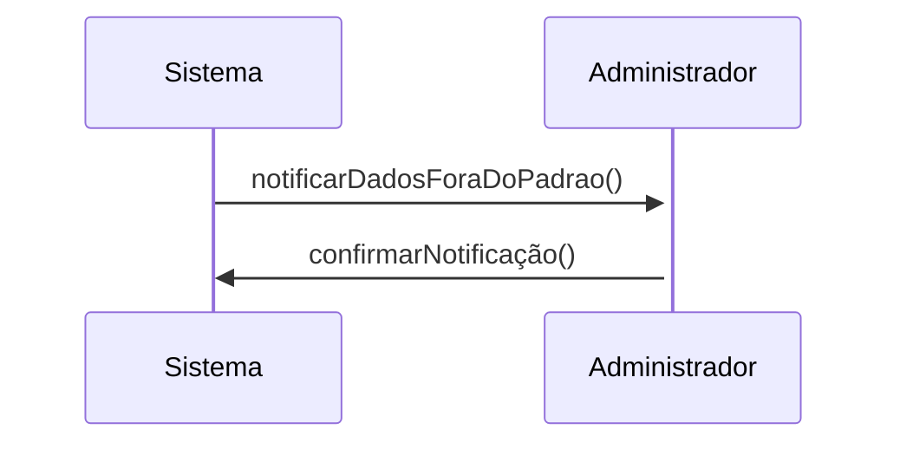

# Funcionalidades do Sistema

## Funcionalidades para Usuários

### 1. Enviar Arquivo CSV
Quando o usuário envia um arquivo CSV, o sistema deve formatar e interpretar o arquivo para armazená-lo no banco de dados e gerar gráficos com os dados coletados.

### 2. Visualizar Gráficos
Após o envio e formatação dos dados, o usuário pode visualizar os gráficos gerados.

### 3. Baixar Arquivo Formatado
O usuário pode baixar o arquivo já formatado pelo sistema.

### 4. Receber Notificações
O sistema envia notificações ao usuário sobre a necessidade de envio de dados.

### 5. Assinar Plano Online
O usuário pode assinar um plano online diretamente pela plataforma, escolhendo entre diferentes opções de assinatura.

## Funcionalidades para Administradores

### 6. Cadastrar Usuário
O administrador pode cadastrar novos usuários na plataforma e definir um plano de início e fim de cortesia.

### 7. Definir Plano de Início e Fim de Cortesia
Ao criar a conta de um usuário, o administrador pode definir um período de cortesia para o plano de assinatura.

### 8. Treinar Usuário
O administrador fornece um breve treinamento para a utilização da plataforma.

### 9. Visualizar Dados Enviados
O administrador pode visualizar os dados enviados pelos usuários de forma centralizada.

### 10. Notificar Administrador
O sistema notifica o administrador em caso de dados fora do padrão esperado.

