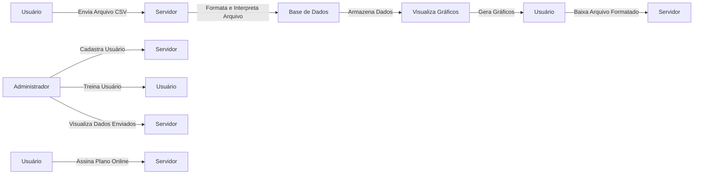

# Objetivos do Sistema

## Objetivos Primários
- **Exibição dos dados do sistema**: Fornecer uma visualização clara e detalhada dos dados coletados pelos sensores.
- **Formatação de arquivos de logs**: Garantir que os arquivos de logs sejam formatados adequadamente para análise.
- **Comprovação de medição/coleta/desempenho**: Verificar e confirmar a precisão dos dados coletados.
- **Geração de gráficos dos dados enviados**: Criar gráficos que representem visualmente os dados coletados.
- **Comparação com dados históricos**: Permitir a comparação dos dados atuais com dados históricos para análise de tendências.

## Objetivos Secundários
- **Análise dos dados dos sensores**: Verificar se os dados estão dentro dos parâmetros médios.
  - Verificar no histórico de medições para indicar se existem valores fora da média (exibir em um gráfico).
- **Exportação dos dados para a EPE**: Converter arquivos CSV para o formato proprietário de texto da EPE.
- **Visualização dos dados em relatórios**: Gerar relatórios detalhados com base nos dados coletados.

## Objetivos Terciários
- **Sistema em nuvem**: Garantir que o sistema esteja disponível na nuvem para acessibilidade e escalabilidade.

## Gestão de Usuários
- **Criação de contas por administradores**: Permitir que o administrador crie e gerencie contas de usuários.
- **Assinatura de planos online**: Permitir que os usuários assinem um plano online diretamente pela plataforma.

## Diagrama de Caso de Uso

## Descrição dos Casos de Uso

### Usuário
- **Enviar Arquivo CSV**: O usuário pode enviar um arquivo CSV contendo dados de medição.
- **Visualizar Gráficos**: O usuário pode visualizar gráficos gerados a partir dos dados enviados.
- **Baixar Arquivo Formatado**: O usuário pode baixar o arquivo formatado para envio.
- **Assinar Plano Online**: O usuário pode assinar um plano diretamente pela plataforma, permitindo acesso a funcionalidades premium.

### Administrador
- **Cadastrar Usuário**: O administrador pode cadastrar novos usuários na plataforma.
- **Treinar Usuário**: O administrador fornece um breve treinamento para utilização da plataforma.
- **Visualizar Dados Enviados**: O administrador pode visualizar os dados enviados pelos usuários.